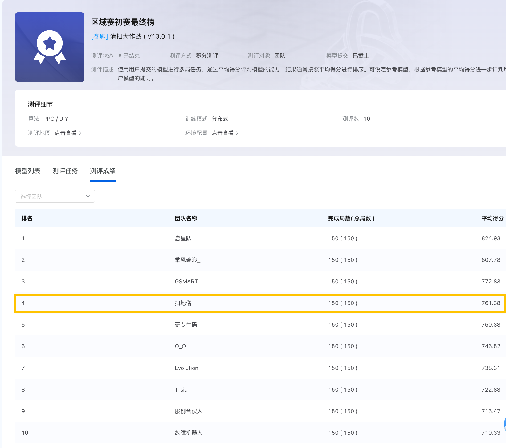
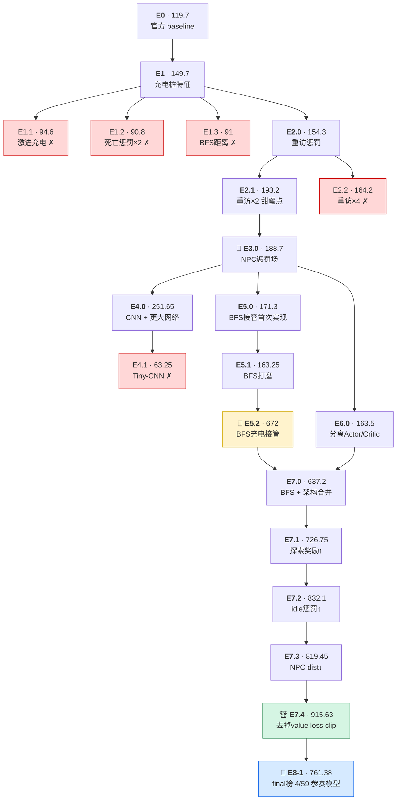
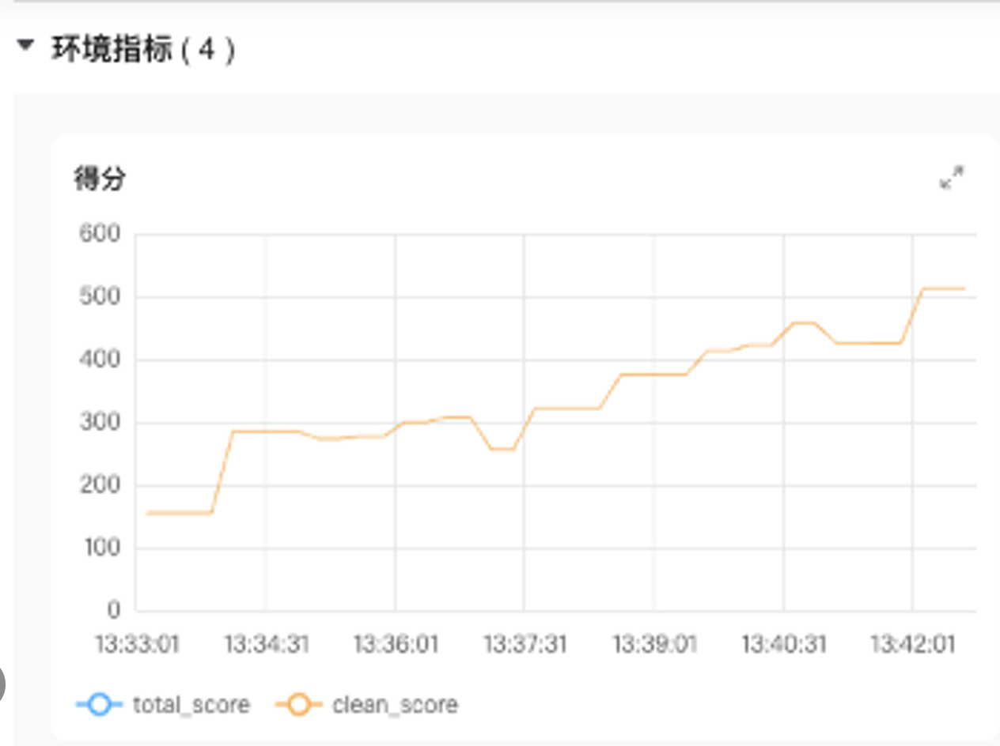

# 开悟02 扫地机器人 — 项目记录

## 项目概况

- 平台：开悟（Kaiwu）四足机器人强化学习挑战北部赛区初赛
- 任务：扫地机器人，4v4（4 个玩家 + 4 个 NPC），128×128 地图

## Final Leaderboard

| 项目 | 数值 |
|------|------|
| 团队 | 扫地僧 |
| 排名 | **4 / 59** |
| 平均得分 | **761.38** |
| 开源算法 | E8-1 + dynamic charging |

## Evaluation Settings

### early setting

该 setting 是比赛前期天梯使用的环境配置。

| 参数 | 值 |
|------|----|
| robot_count | 4 |
| charger_count | 4 |
| max_step | 1000 |
| battery_max | 200 |
| 训练地图 | 1–8 |
| 测试地图 | 9–10 |

### final setting

该 setting 是后两次天梯采用的官方评测配置。

| 参数 | 值 |
|------|----|
| robot_count | 4 |
| charger_count | 3 |
| max_step | 1000 |
| battery_max | 150 |
| 官方评测局数 | 150 |

E8-1 是最终开源版本。它不是单纯把 early setting 下的 E7.4 继续训练，而是在官方 final setting 的少桩、低电量环境下，重新优化了回桩触发、回桩路径和安全过滤等**规则算法**，优先保证 `存活率` ，再追求清扫效率。

## 实验谱系

| 分支 | 实验 | 核心改动 |
|------|------|----------|
| `Jsy/e1-charge` | E1 | 充电桩特征 + 充电奖励（baseline → 149.7）|
| `Jsy/e2-cleaningEfficiency` | E2 | 重访惩罚 + 连续清扫奖励 |
| `Jsy/e3-npcAvoid` | E3 | NPC 切比雪夫距离惩罚场 |
| `Jsy/e5-bfs-charge` | E5 | 硬编码 BFS 充电接管 |
| `Jsy/e6-split-critic` | E6 | 分离 Actor/Critic，Critic 额外 16D 全局特征 |
| `Jsy/e7-unified` | **E7** | E5 + E6 合并 + 奖励重构 + NPC 安全层 |
| `Jsy/e8-awsome-rule` | **E8** | 面向 final setting 的动态充电与安全回桩 |

## 实验谱系图

> 下图展示从 early setting 实验到 final setting 参赛模型的演化。E0-E7.4 的节点得分为 early setting 下该版本最佳训练时长的均分；E8 为 final setting 官方最终榜参赛模型。红色=退步/失败，金色=阶段 SOTA，绿色=early setting 最稳模型，蓝色=final setting 参赛模型。

本仓库为正式开源主 repo；完整开发过程、历史分支和实验脉络可在开发 repo 中回溯：[Kaiwu-robot](https://github.com/SY-Jia06/Kaiwu-robot.git)。

## early setting 实验对比表

> 下表均为 early setting 下的开发期消融结果。局数影响统计稳定性，早期 10 局结果方差较大。粗体行为大版本分组，v0/v1/v2 表示同一子版本的不同训练时长。

| 版本 | 核心改动 | Insight | 训练时长 | 局数 | 均分 |
|------|----------|---------|----------|------|------|
| **E0** | 官方 baseline | score≈120，steps≈200，charge=0，存活但不充电 | 8min | 10 | 119.7 |
| **E1 · 充电模块** | Fork: E0 | | | | |
| E1 | 充电桩特征 (5D) + 充电奖励 + 电量耗尽惩罚 | 显式充电奖励不足以驱动充电，eval charge=0 | 8min | 10 | 149.7 |
| E1.1 | 激进充电参数（threshold↑、coef↑、urgency 连续化、critical zone 惩罚） | 训练中 charge=1.5 但 eval 泛化崩溃；过激策略造成训练-评估分布偏移 | 8min | 10 | 94.6 |
| E1.2 | 死亡惩罚 -5→-10 | 死亡惩罚强度不是瓶颈 | 8min | 10 | 90.8 |
| E1.3 | nearest charger 距离 Chebyshev→BFS 路径距离 | 距离函数精度对充电行为无帮助，充电问题根源不在特征 | 8min | 10 | 91 |
| **E2 · 清扫效率** | Fork: E1 | | | | |
| E2.0 | +revisit_penalty(-0.005) +streak_bonus(+0.01 连续清扫≥3步) | 惩罚低效行为比奖励充电更有效 | 8min | 10 | 154.3 |
| E2.1 | revisit_penalty -0.005→-0.01（翻倍） | 甜蜜点：适度加强重访惩罚，单局最高 341 | 8min | 10 | 193.2 |
| E2.2 | revisit_penalty -0.01→-0.02（再翻倍） | 过强惩罚适得其反，退步 | 8min | 10 | 164.2 |
| **E3 · NPC 惩罚场** | Fork: E2.1 | | | | |
| E3.0 · v0 | +NPC 切比雪夫距离惩罚场（距离≤5，COEF=-0.05） | RL 难从稀疏碰撞信号学会躲避；排除碰撞 outlier 后≈E2.1，碰撞是损分项而非策略退步 | 8min | 10 | 154.4 |
| E3.0 · v1 | — | 延训小幅提升，40 局方差↓ | 16min | 40 | 182.38 |
| E3.0 · v2 | — | 趋于平稳，NPC penalty 不是正确方向 | 32min | 40 | 188.7 |
| **E4 · 模型升级** | Fork: E3 | | | | |
| E4.0 · v0 | CNN 处理地图 + 更大网络 | CNN 能提取空间结构，短训练未充分发挥 | 8min | 20 | 168.9 |
| E4.0 · v1 | — | 延训线性提升 | 16min | 40 | 171.4 |
| E4.0 · v2 | — | — | 30min | 40 | 188.83 |
| E4.0 · v3 | — | 当时最佳，更强表达力需足够训练时间 | 32min | 20 | 251.65 |
| E4.1 | Tiny-CNN（轻量卷积，网络缩小） | 过小的网络容量反而损害表达力，得分跌破 baseline | 8min | 20 | 63.25 |
| **E5 · BFS 充电接管** | Fork: E3 | | | | |
| E5.0 · v0 | BFS 充电接管首次实现；沿用 E3 74D MLP 基线（非 E4 CNN）；BFS 路径规避 NPC 碰撞区 | 首次验证硬编码接管可行性，得分未见跨越式提升 | 16min | 10 | 171.3 |
| E5.1 · v0 | — | — | 8min | 10 | 146.3 |
| E5.1 · v1 | — | — | 8min | 20 | 130.25 |
| E5.1 · v2 | — | — | 16min | 20 | 163.25 |
| E5.2 · v0 | 硬编码 BFS 充电接管 | 把确定性充电从 RL 中剥离，梯度更纯；跨越式提升 | 8min | 40 | 494.53 |
| E5.2 · v1 | — | 延训继续涨（valon12） | 32min | 40 | 622.48 |
| 🥈 **E5.2 · v2** | — | **前 SOTA，BFS 接管充分验证** | 32min | 40 | **672.28** |
| **E6 · 分离 Actor/Critic** | Fork: E3 | | | | |
| E6.0 · v0 | 分离 Actor/Critic，Critic 额外 16D 全局特征（充电桩+NPC坐标） | 未继承 BFS，得分远低于 E5.2；架构单独验证；CTDE 模式部署只跑 Actor | 8min | 20 | 162.25 |
| E6.0 · v1 | — | 延训无明显提升，瓶颈在无 BFS | 16min | 20 | 163.5 |
| **E7 · BFS + 分离架构合并** | Fork: E5.2 + E6 | | | | |
| E7.0 · v0 | E5.2 BFS + E6 架构合并，奖励重构，NPC 安全层 | 两支线合并，接管确定性行为，RL 只学清扫路径 | 8min | 20 | 417.5 |
| E7.0 · v1 | — | 延训翻倍涨分，架构红利充分释放 | 16min | 20 | 637.2 |
| E7.1 · v0 | 探索奖励 0.02→0.05，死亡终局加存活分量 | 探索奖励不足时 agent 困在充电桩周边安全区 | 8min | 20 | 396.35 |
| E7.1 · v1 | — | — | 16min | 20 | 547.35 |
| E7.1 · v2 | — | 32min 首次 700+，当时最佳 | 32min | 20 | 726.75 |
| E7.2 · v0 | idle 惩罚 -0.05→-0.15，+无进展惩罚 -0.05/5步 | 踱步是低分和方差来源 | 8min | 20 | 673.3 |
| E7.2 · v1 | — | 32min 历史最高 832.1，事后看 E7.2 是 32min 最优版本 | 32min | 20 | 832.1 |
| E7.3 · v0 | NPC_SAFE_DIST 3→2；Critic 16D→19D + lr×3 | 事后发现对 value_loss 无效，真正瓶颈是 clip | 8min | 20 | 667.65 |
| E7.3 · v1 | — | E7.3 在 32min 下略低于 E7.2，印证调参方向错误 | 32min | 40 | 819.45 |
| E7.4 · v0 | **去掉 value loss clipping** | clip=0.2 远小于回报尺度 ~50，Critic 追不上目标；Critic 修复需更长训练才能释放 | 8min | 40 | 613.08 |
| E7.4 · v1 | — | 32min 下与 E7.2/7.3 持平，优势尚未体现 | 32min | 40 | 817.88 |
| 🏆 **E7.4 · v2** | — | **40/40 存活至 1000 步，平均得分率 90%+；map9: 921 / map10: 910.25 / 平均充电 6.88 次** · [训练曲线，价值损失成功拟合](assets/e7.4-training-curve.png) · [实验结果](assets/e7.4-benchmark-result.png) | **48min** | **40** | **915.63** |

---

## E8-1 + dynamic charging

E8-1 的核心目标不是继续堆 reward，而是让 agent 在更苛刻的 final setting 下稳定活满局。final setting 只有 3 个充电桩、电量上限降到 150，原来 early setting 下“离桩远一点再回也来得及”的策略会更容易死在路上。因此 E8-1 把充电从单一阈值判断升级成动态接管：正常状态下仍由 PPO 选择清扫动作，电量进入风险区后由 BFS 回桩接管，低电量或 BFS 不稳定时再用更保守的 fallback 逼近已知充电桩。

主要改动：

### 1. 动态回桩触发

不只看 `battery <= bfs_dist + margin`，还加入 critical buffer、连续触发确认和几何距离 fallback，避免因为某一帧 BFS 失败或地图未知导致错过回桩窗口。

代码索引：
- [charge 参数](code/agent_ppo/agent.py#L32-L42)
- [`_should_force_charge`](code/agent_ppo/agent.py#L212-L246)

### 2. 终局禁充

如果当前电量已经足够撑到 `max_step`，关闭充电接管，让 agent 把最后的时间用于清扫，而不是无意义回桩。

代码索引：
- [`_can_finish_without_charge`](code/agent_ppo/agent.py#L248-L250)
- [charge mode 释放](code/agent_ppo/agent.py#L183-L190)

### 3. 悲观 BFS

未知区域默认不可走，禁止对角穿角，按单个充电桩构建 access zone，避免把“看起来近但实际不可达”的桩当作安全目标。

代码索引：
- [`_is_traversable` / `can_move`](code/agent_ppo/pathfinding.py#L30-L60)
- [`_charger_access_zone`](code/agent_ppo/pathfinding.py#L88-L104)
- [`bfs_to_charger`](code/agent_ppo/pathfinding.py#L201-L245)

### 4. NPC 安全过滤

动作输出后仍经过 NPC safety layer；低电量回桩时使用更保守的 NPC block/safe distance，优先保证活到充电桩。

代码索引：
- [评估动作过滤](code/agent_ppo/agent.py#L138-L147)
- [训练动作过滤](code/agent_ppo/agent.py#L198-L203)
- [`_charge_npc_block_radius` / `_charge_safe_dist`](code/agent_ppo/agent.py#L267-L274)
- [`npc_safe_filter`](code/agent_ppo/pathfinding.py#L265-L296)

### 5. 回桩进展约束

在 critical battery 下，如果当前动作不能缩短到充电桩的 BFS 距离，会强制选择能推进回桩的合法动作，减少低电量时的抖动和绕路。

代码索引：
- [`_force_charge_progress_if_critical`](code/agent_ppo/agent.py#L318-L357)
- [`_action_reduces_charge_dist`](code/agent_ppo/agent.py#L359-L377)

### 6. 站位特征与第一条命 shaping

actor 看到最近两个可达充电桩的距离、方向、可达数量、BFS 有效性和电量状态；第一条命用“最近两个可达桩均距下降”作为弱 shaping，鼓励开局向更安全的多桩区域靠拢。

代码索引：
- [`reachable_charger_distances`](code/agent_ppo/pathfinding.py#L173-L198)
- [`_get_charger_feature`](code/agent_ppo/feature/preprocessor.py#L412-L447)
- [第一条命 shaping](code/agent_ppo/feature/preprocessor.py#L537-L542)

这条线的经验是：在扫地任务里，充电和避障属于确定性约束，应该尽量用接管/过滤保证下限；PPO 的主要学习空间应该留给“去哪片区域清扫、如何减少重复访问、如何把 1000 步转化成更多清扫格子”。

---

## E7.4 设计哲学

这是我们 reward 曲线长势最稳、上升最快的模型，约 9 分钟可以拿到 500+ 分。

硬件环境：Mac M1 Pro。

查看设计思路、细节，请到 [E7.4 Design Philosophy](docs/e7.4-design-philosophy.md)。

---

## 版本快照

| 版本 | tag | commit | 核心变化 |
|------|-----|--------|----------|
| E7.0 | — | `7f6f77a` | E5+E6 合并，奖励重构，NPC 安全层 |
| E7.1 | `e7.1` | `822e794` | 探索奖励 0.02→0.05，死亡终局加存活分量 |
| E7.2 | — | `dc2c941` | idle 惩罚 -0.05→-0.15，新增无进展惩罚 -0.05/5步 |
| E7.3 | — | `b9d4bed` | NPC_SAFE_DIST 3→2；Critic 16D→19D + lr×3（事后发现对 value_loss 无效，真正瓶颈是 E7.4）|
| E7.4 | — | `a85e909` | 去掉 value loss clipping：clip=0.2 远小于回报尺度 ~50，Critic 每步只能动 ±0.2，追不上目标 |
| E8-1 | — | `78f685c` | 面向 final setting 的 dynamic charging：动态回桩触发、悲观 BFS、critical progress 约束和多桩站位特征 |

---
